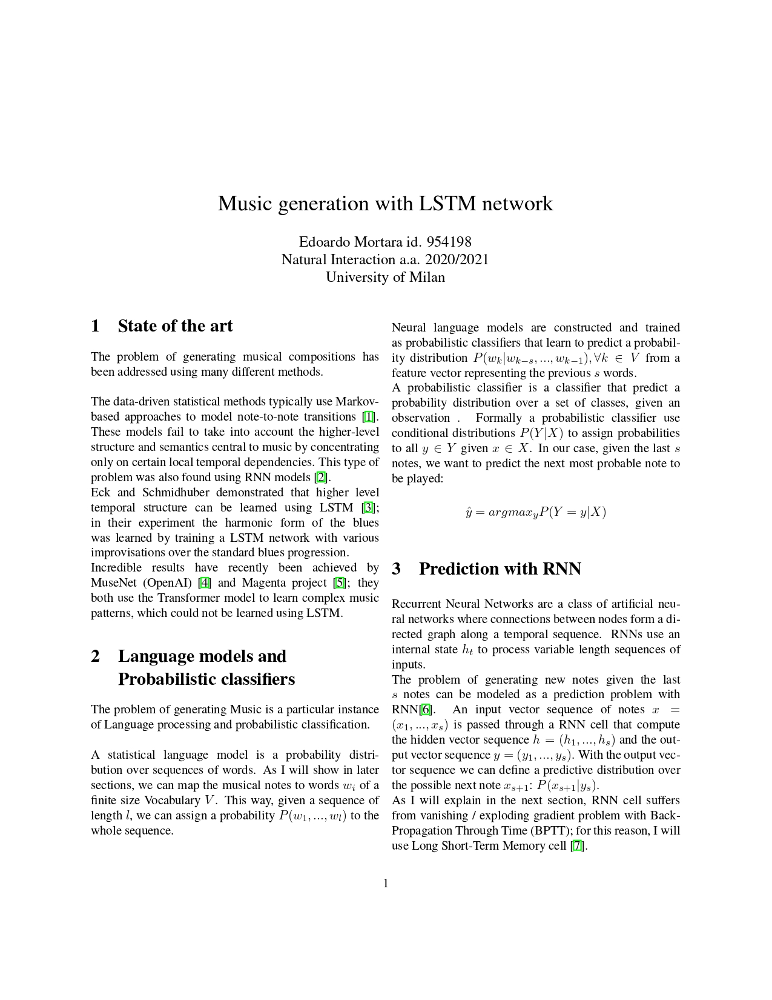
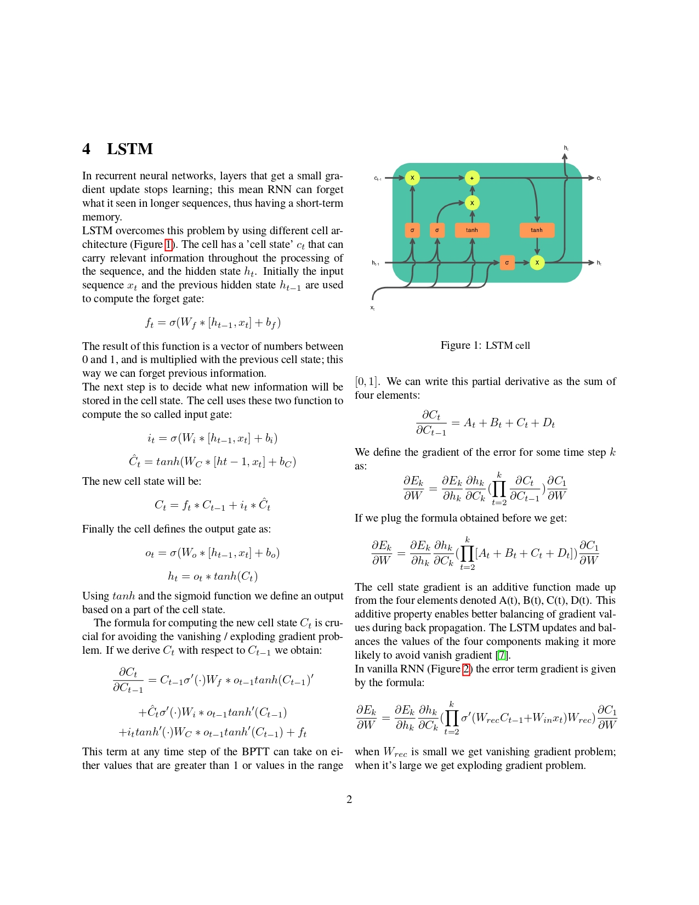
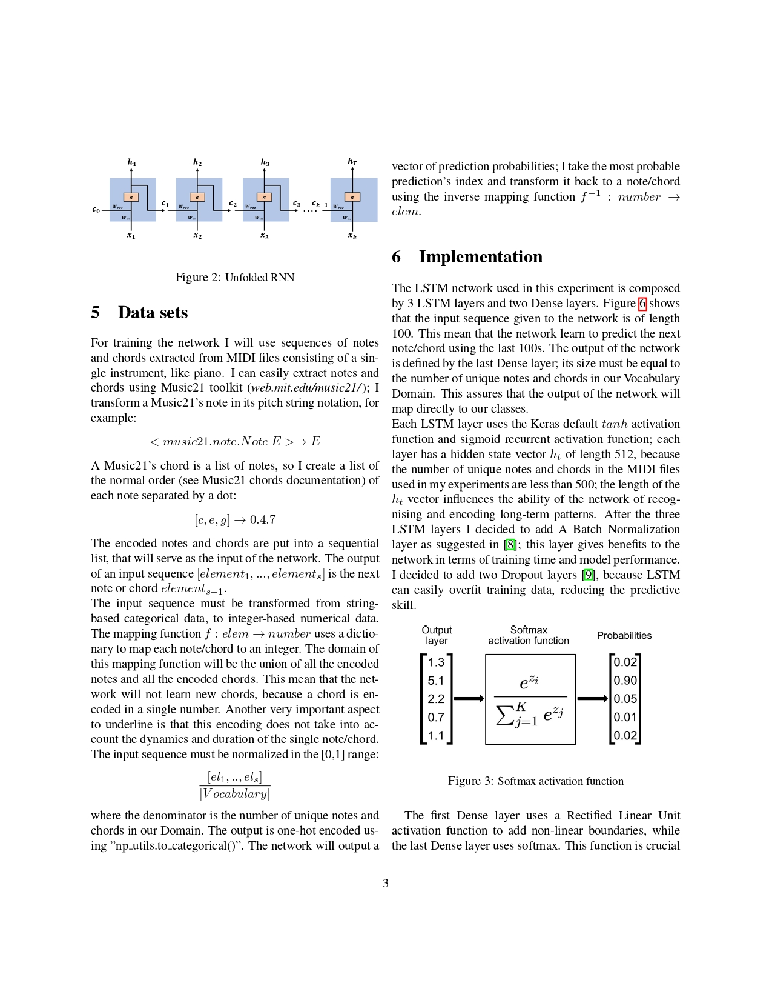
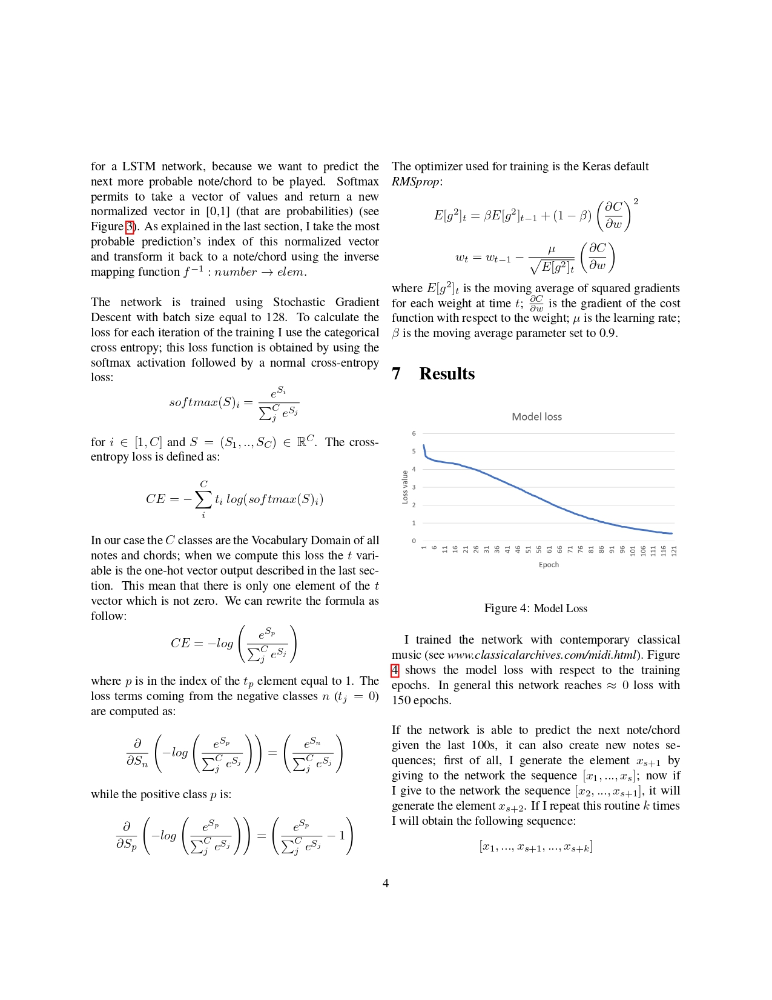
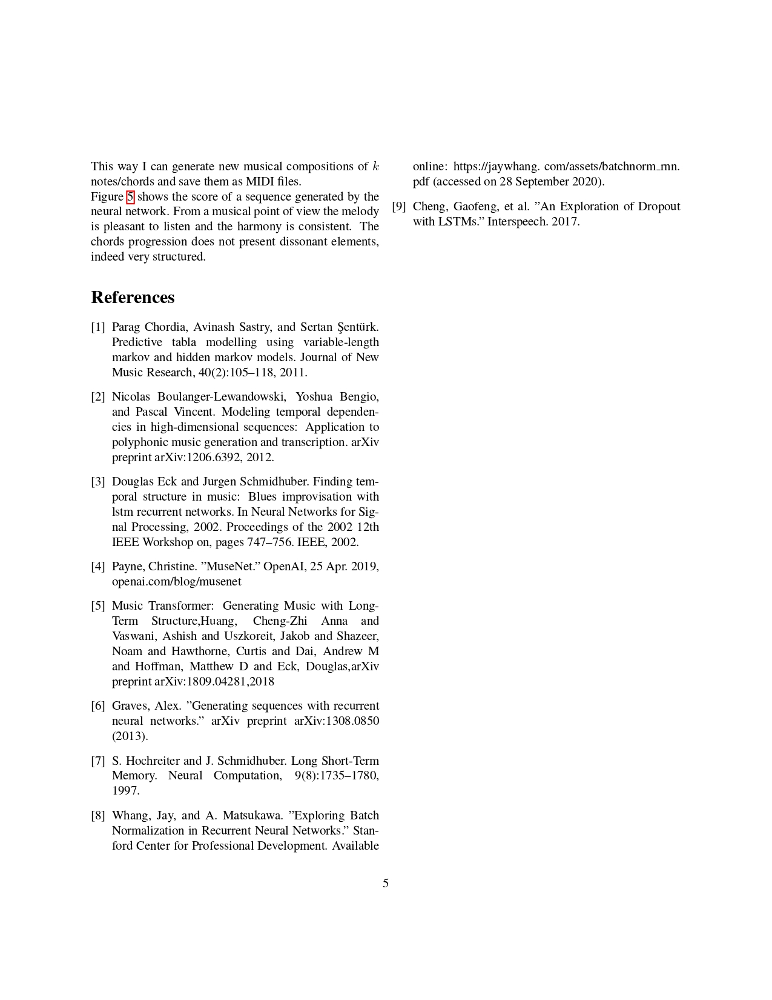
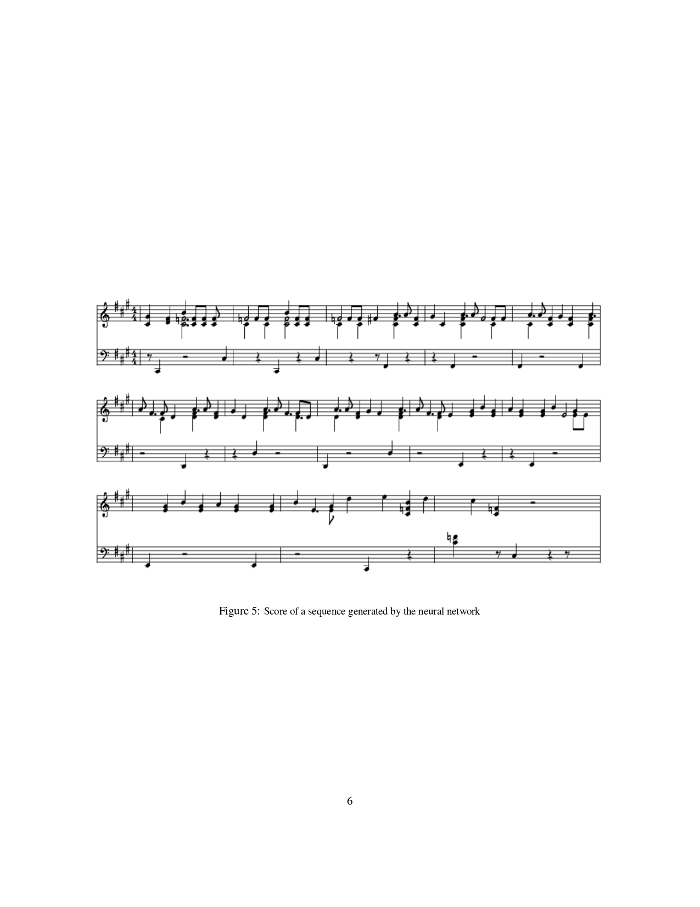
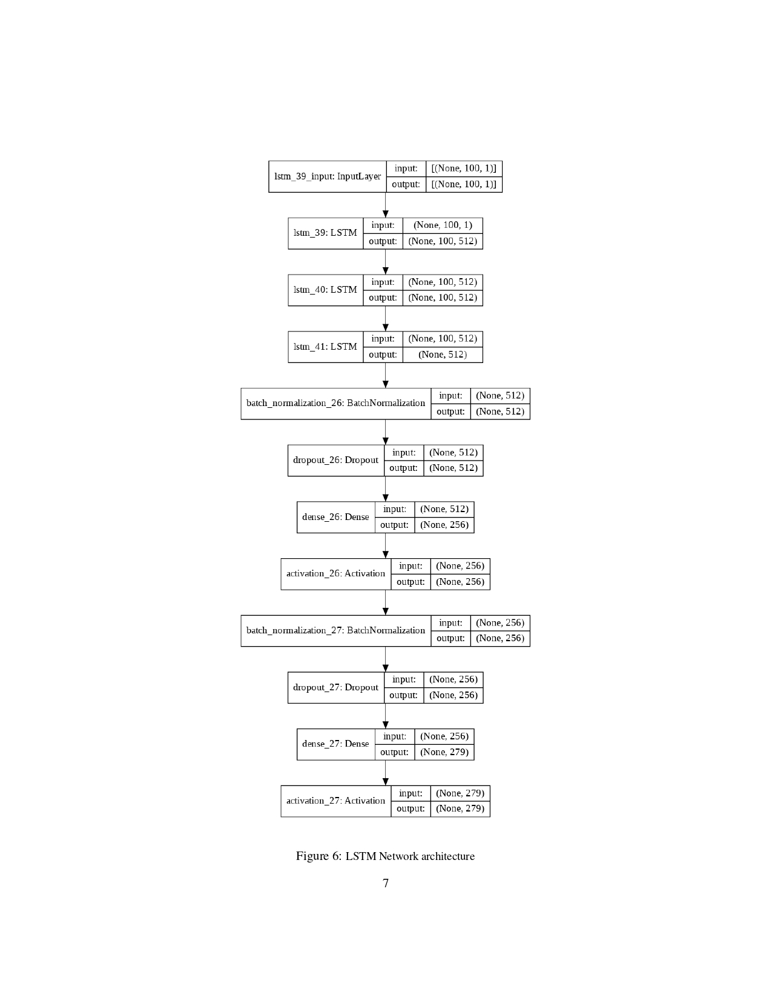

# Music generation with LSTM network

## Edoardo Mortara, University of Milan

## State of the art

The problem of generating musical compositions has
been addressed using many different methods.
The data-driven statistical methods typically use Markov-
based approaches to model note-to-note transitions [1].
These models fail to take into account the higher-level
structure and semantics central to music by concentrating
only on certain local temporal dependencies. This type of
problem was also found using RNN models [2].
Eck and Schmidhuber demonstrated that higher level
temporal structure can be learned using LSTM [3];
in their experiment the harmonic form of the blues
was learned by training a LSTM network with various
improvisations over the standard blues progression.
Incredible results have recently been achieved by
MuseNet (OpenAI) [4] and Magenta project [5]; they
both use the Transformer model to learn complex music
patterns, which could not be learned using LSTM.

